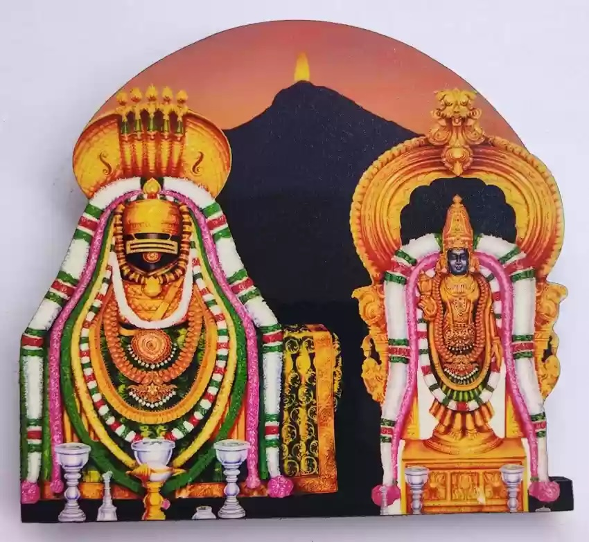

# Lingashtakam

spoitfy: https://open.spotify.com/track/6fpGkH3nXGUDJ7RPALsT9y?si=4b41500ced46472d

[wowers](https://nithyanandapedia.org/wiki/Kailasa_Paramparagatha_Arunagiri_Yogishwara_Adi_Arunachala_Sarvajnapeetha_Samrajyam#Paramasiva.E2.80.99s_promise_to_humanity_in_Tiruvannamalai)



```
ब्रह्ममुरारिसुरार्चितलिङ्गं
निर्मलभासितशोभितलिङ्गम् ।
जन्मजदुःखविनाशकलिङ्गं
तत्प्रणमामि सदाशिवलिङ्गम् ॥ १ ॥
```


ब्रह्म (brahma): Brahma (the creator god)
मुरारि (murāri): Murari (Vishnu, the destroyer of the demon Mura)
सुर (sura): gods
अर्चित (arcita): worshipped
लिङ्गं (liṅgam): the Lingam (symbol of Shiva)
निर्मल (nirmala): pure, spotless
भासित (bhāsita): shining, radiant
शोभित (śobhita): adorned, beautified
लिङ्गम् (liṅgam): the Lingam
जन्मज (janmaja): born from birth, caused by birth
दुःख (duḥkha): sorrow, suffering
विनाशक (vināśaka): destroyer
लिङ्गं (liṅgam): the Lingam
तत् (tat): that
प्रणमामि (praṇamāmi): I bow down, I salute
सदाशिव (sadāśiva): Sadashiva (eternal Shiva)
लिङ्गम् (liṅgam): the Lingam


"The Lingam worshipped by Brahma, Murari (Vishnu), and the gods, the Lingam shining with pure radiance and adorned, the Lingam that destroys the sorrows born from birth, to that Sadashiva Lingam, I always bow down."


```
देवमुनिप्रवरार्चितलिङ्गं
कामदहं करुणाकरलिङ्गम् ।
रावणदर्पविनाशनलिङ्गं
तत्प्रणमामि सदाशिवलिङ्गम् ॥ २ ॥
```

देव (deva): gods
मुनि (muni): sages
प्रवर (pravara): best, foremost
अर्चित (arcita): worshipped
लिङ्गं (liṅgam): the Lingam
काम (kāma): desire (referring to Kama, the god of desire)
दहं (daham): burning, destroyer
करुणाकर (karuṇākara): embodiment of compassion
लिङ्गम् (liṅgam): the Lingam
रावण (rāvaṇa): Ravana (the demon king)
दर्प (darpa): pride, arrogance
विनाशन (vināśana): destroyer
लिङ्गं (liṅgam): the Lingam
तत् (tat): that
प्रणमामि (praṇamāmi): I bow down, I salute
सदाशिव (sadāśiva): Sadashiva (eternal Shiva)
लिङ्गम् (liṅgam): the Lingam


"The Lingam worshipped by the foremost gods and sages, the Lingam that burns desire, the embodiment of compassion, the Lingam that destroys Ravana's pride, to that Sadashiva Lingam, I bow down."


```
सर्वसुगन्धिसुलेपितलिङ्गं
बुद्धिविवर्धनकारणलिङ्गम् ।
सिद्धसुरासुरवन्दितलिङ्गं
तत्प्रणमामि सदाशिवलिङ्गम् ॥ ६ ॥
```


सर्व (sarva): all
सुगन्धि (sugandhi): fragrant
सुलेपित (sulepita): well-anointed, well-smeared
लिङ्गं (liṅgam): the Lingam
बुद्धि (buddhi): intellect, wisdom
विवर्धन (vivardhana): increasing, enhancing
कारण (kāraṇa): cause, reason
लिङ्गम् (liṅgam): the Lingam
सिद्ध (siddha): perfected beings, accomplished ones
सुर (sura): gods
असुर (asura): demons
वन्दित (vandita): worshipped, saluted
लिङ्गं (liṅgam): the Lingam
तत् (tat): that
प्रणमामि (praṇamāmi): I bow down, I salute
सदाशिव (sadāśiva): Sadashiva (eternal Shiva)
लिङ्गम् (liṅgam): the Lingam


"The Lingam well-anointed with all fragrant substances, the Lingam that is the cause of increasing intellect, the Lingam worshipped by perfected beings, gods, and demons, to that Sadashiva Lingam, I bow down."

```
कनकमहामणिभूषितलिङ्गं
फणिपतिवेष्टितशोभितलिङ्गम् ।
दक्षसुयज्ञविनाशनलिङ्गं
तत्प्रणमामि सदाशिवलिङ्गम् ॥ ७ ॥
```

कनक (kanaka): gold
महामणि (mahā-maṇi): great jewel (mahā = great, maṇi = jewel)
भूषित (bhūṣita): adorned, decorated
लिङ्गं (liṅgam): the Lingam
फणिपति (phaṇi-pati): lord of serpents (phaṇin = serpent, pati = lord) - This refers to the serpent king Vasuki, who is often depicted adorning Shiva.
वेष्टित (veṣṭita): encircled, surrounded
शोभित (śobhita): adorned, beautified
लिङ्गम् (liṅgam): the Lingam
दक्ष (dakṣa): Dakṣa (the father of Sati, Shiva's first wife)
सुयज्ञ (su-yajña): great sacrifice (su = good, yajña = sacrifice)
विनाशन (vināśana): destroyer
लिङ्गं (liṅgam): the Lingam
तत् (tat): that
प्रणमामि (praṇamāmi): I bow down, I salute
सदाशिव (sadāśiva): Sadashiva (eternal Shiva)
लिङ्गम् (liṅgam): the Lingam

"The Lingam adorned with great jewels of gold, the Lingam beautified, encircled by the lord of serpents, the Lingam that destroyed the great sacrifice of Daksha, to that Sadashiva Lingam, I bow down."

```
कुङ्कुमचन्दनलेपितलिङ्गं
पङ्कजनामदशोभितलिङ्गम् ।
सञ्चितपापविनाशनलिङ्गं
तत्प्रणमामि सदाशिवलिङ्गम् ॥ ३ ॥
```

कुङ्कुम (kuṅkuma): saffron
चन्दन (candana): sandalwood
लेपित (lepita): smeared, anointed
लिङ्गं (liṅgam): the Lingam
पङ्कज (paṅkaja): lotus
नाम (nāma): name
अद (ada): eating, consuming (here, meaning adorned with)
शोभित (śobhita): adorned, beautified
लिङ्गम् (liṅgam): the Lingam
सञ्चित (sañcita): accumulated
पाप (pāpa): sins
विनाशन (vināśana): destroyer
लिङ्गं (liṅgam): the Lingam
तत् (tat): that
प्रणमामि (praṇamāmi): I bow down, I salute
सदाशिव (sadāśiva): Sadashiva (eternal Shiva)
लिङ्गम् (liṅgam): the Lingam

"The Lingam smeared with saffron and sandalwood, the Lingam adorned with the names of the lotus, the Lingam that destroys accumulated sins, to that Sadashiva Lingam, I bow down."


```
देवगणार्चितसेवितलिङ्गं
भावैर्भक्तिभिरेव च लिङ्गम् ।
दिनकरकोटिप्रकाशितलिङ्गं
तत्प्रणमामि सदाशिवलिङ्गम् ॥ ४ ॥
```

देव (deva): gods
गण (gaṇa): groups, multitudes
अर्चित (arcita): worshipped
सेवित (sevita): served, attended to
लिङ्गं (liṅgam): the Lingam
भावैः (bhāvaiḥ): by emotions, by feelings
भक्तिभिः (bhaktibhiḥ): by devotions, by acts of devotion
एव (eva): indeed, only
च (ca): and
लिङ्गम् (liṅgam): the Lingam
दिनकर (dinakara): sun
कोटि (koṭi): crore (ten million), multitudes
प्रकाशित (prakāśita): illuminated, shone
लिङ्गं (liṅgam): the Lingam
तत् (tat): that
प्रणमामि (praṇamāmi): I bow down, I salute
सदाशिव (sadāśiva): Sadashiva (eternal Shiva)
लिङ्गम् (liṅgam): the Lingam

```
अष्टदलोपरिवेष्टितलिङ्गं
सर्वसमुद्भवकारणलिङ्गम् ।
अष्टदरिद्रविनाशितलिङ्गं
तत्प्रणमामि सदाशिवलिङ्गम् ॥ ५ ॥
```

अष्ट (aṣṭa): eight
दल (dala): petals
उपरि (upari): above, upon
वेष्टित (veṣṭita): surrounded, encircled
लिङ्गं (liṅgam): the Lingam
सर्व (sarva): all
समुद्भव (samudbhava): origin, arising
कारण (kāraṇa): cause, reason
लिङ्गम् (liṅgam): the Lingam
अष्ट (aṣṭa): eight
दरिद्र (daridra): poverty, destitution
विनाशित (vināśita): destroyed, removed
लिङ्गं (liṅgam): the Lingam
तत् (tat): that
प्रणमामि (praṇamāmi): I bow down, I salute
सदाशिव (sadāśiva): Sadashiva (eternal Shiva)
लिङ्गम् (liṅgam): the Lingam


"The Lingam encircled by eight petals, the Lingam that is the cause of the origin of all, the Lingam that destroys eight kinds of poverty, to that Sadashiva Lingam, I bow down."

```
सुरगुरुसुरवरपूजितलिङ्गं
सुरवनपुष्पसदार्चितलिङ्गम् ।
पार्वतीरमणं परमात्मलिङ्गं
तत्प्रणमामि सदाशिवलिङ्गम् ॥ ८ ॥
```

सुर (sura): gods
गुरु (guru): teacher, preceptor (referring to Brihaspati, the guru of the gods)
सुरवर (sura-vara): best among gods (sura = god, vara = best) - This could refer to Indra, the king of gods.
पूजित (pūjita): worshipped
लिङ्गं (liṅgam): the Lingam
सुरवन (sura-vana): garden of the gods
पुष्प (puṣpa): flower
सत् (sat): good, excellent
अर्चित (arcita): worshipped
लिङ्गम् (liṅgam): the Lingam
पार्वती (pārvatī): Parvati (Shiva's consort)
रमणं (ramaṇam): beloved, husband
परमात्म (paramātma): the Supreme Soul (parama = supreme, ātmā = soul)
लिङ्गं (liṅgam): the Lingam
तत् (tat): that
प्रणमामि (praṇamāmi): I bow down, I salute
सदाशिव (sadāśiva): Sadashiva (eternal Shiva)
लिङ्गम् (liṅgam): the Lingam


"The Lingam worshipped by the preceptor of the gods (Brihaspati) and the best of the gods, the Lingam worshipped with excellent flowers from the garden of the gods, the Lingam that is the beloved of Parvati and the Supreme Soul, to that Sadashiva Lingam, I bow down."

```
लिङ्गाष्टकमिदं पुण्यं यः पठेत् शिवसन्निधौ ।
शिवलोकमवाप्नोति शिवेन सह मोदते ॥
```
लिङ्गाष्टकम् (liṅgāṣṭakam): Lingashtakam (the eight verses about the Lingam)
इदं (idaṃ): this
पुण्यं (puṇyaṃ): sacred, meritorious, virtuous
यः (yaḥ): who, whoever
पठेत् (paṭhet): reads, recites
शिव (śiva): Shiva
सन्निधौ (sannidhau): in the presence of, near
शिवलोकम् (śivalokam): the world of Shiva, Shiva's abode
अवाप्नोति (avāpnoti): obtains, attains, reaches
शिवेन (śivena): with Shiva
सह (saha): together
मोदते (modate): rejoices, delights

